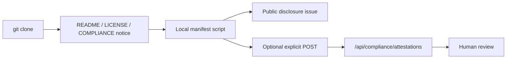

# Compliance Collector Design

Airspace uses a transparent compliance collector model:

1. **No hidden collection.**
2. **No clone-time telemetry.**
3. **No secret collection.**
4. **Explicit self-attestation only.**
5. **Public disclosure preferred over private reporting.**

## Architecture

The product collector is an API surface in a running Airspace instance. It does not phone home to LeosSoftwareLLC or GitHub. If an organization wants to submit to a central registry, they must explicitly configure a target and run the submission.

## API

### `GET /api/compliance/policy`

Returns:

- license identifier,
- public-use policy version,
- obligations,
- prohibited collection practices,
- legal note,
- confirmation that hidden telemetry and clone-time collection are disabled.

### `GET /api/compliance/manifest`

Returns:

- project and policy identity,
- repository URL,
- disclosure requirements,
- redaction rules,
- attestation endpoint,
- public registry URL,
- whether an optional collector URL is configured.

### `POST /api/compliance/attestations`

Accepts a public-use attestation. Accepted attestations must include:

- organization,
- purpose,
- use type,
- public disclosure URL,
- published source URL,
- published redacted operational configuration URL,
- AGPL acknowledgement,
- public-use/AI-policy acknowledgement,
- source publication confirmation,
- operational configuration publication confirmation,
- secret-redaction confirmation.

The collector returns `INCOMPLETE_DISCLOSURE` when required fields are missing. This is intentional: incomplete reports are evidence of what still needs review, not a silent failure.

### `GET /api/compliance/attestations`

Returns attestations retained by the current process. This is local/demo storage, not a durable enforcement database.

## Operational Configuration Transparency

Airspace asks users to publish non-secret configuration because safety-relevant behavior often lives outside source code:

- enabled provider/adapters,
- source modes and freshness policy,
- route-impact thresholds,
- decision rules,
- calibration version,
- agent safety policy,
- replay/audit settings,
- deployment topology,
- redacted env-var names.

This does not mean publishing secrets. Redacted templates are the expected artifact.

## Legal Boundaries

The legal license is `AGPL-3.0-or-later`. AGPL is a strong copyleft license aimed at preserving source availability, including for network service software. The broader Airspace policy for public disclosure, operational configuration transparency, and LLM-assisted recreation is a project governance expectation and may require custom legal drafting for strict enforceability.

This collector is therefore a review and transparency mechanism, not a substitute for legal counsel or formal enforcement.

## Reviewer Checklist

- [ ] Is the user named?
- [ ] Is the purpose of use clear?
- [ ] Is the source URL public?
- [ ] Is the operational configuration URL public and redacted?
- [ ] Are safety-relevant rules, prompts, fixtures, and thresholds inspectable?
- [ ] Are secrets absent?
- [ ] Does the disclosure link back to Airspace?
- [ ] Does the derivative preserve downstream source availability?
